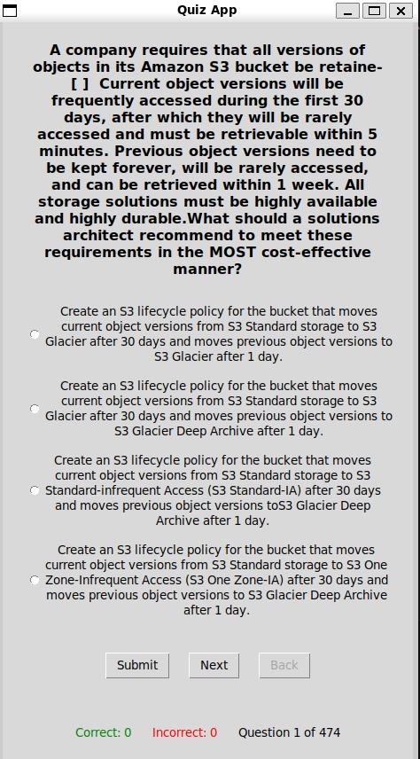

# AWS_Solutions_Quiz_Repo
This repository will leverage questions for the aws solutions archtect exam from README.md files allowing users to run through testing questions interactivly.

## Prerequisite
Run the following commands as a prerequisite
- Install python3
- install pip

## Running tests
Script runs with python 3 simply by running the following command
```
python3 python/quizapp.py professional-readme.md
```

1. Answer the questions clicking the radio button. Correct answers will be marked in green while incorrect will be labeled in red

